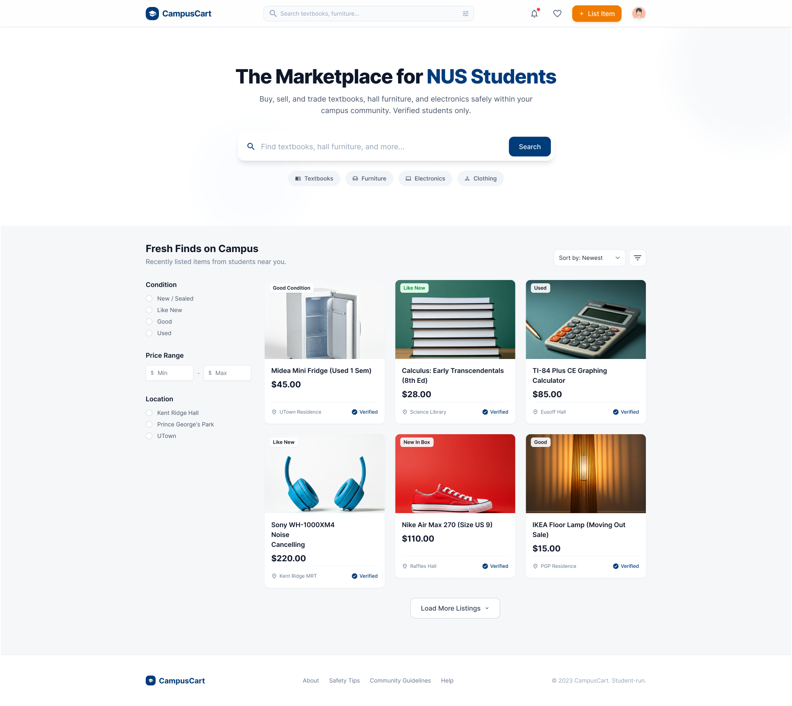
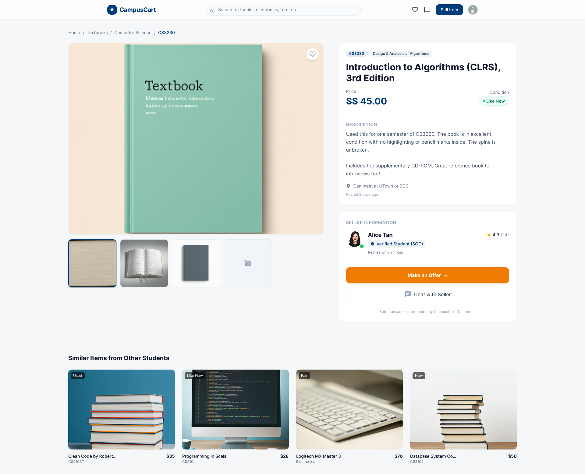
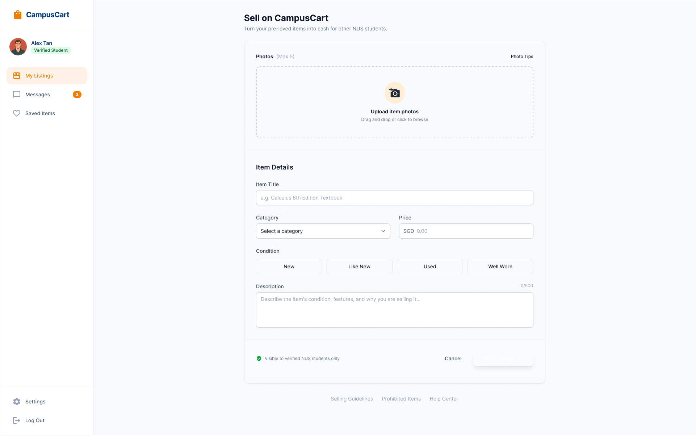
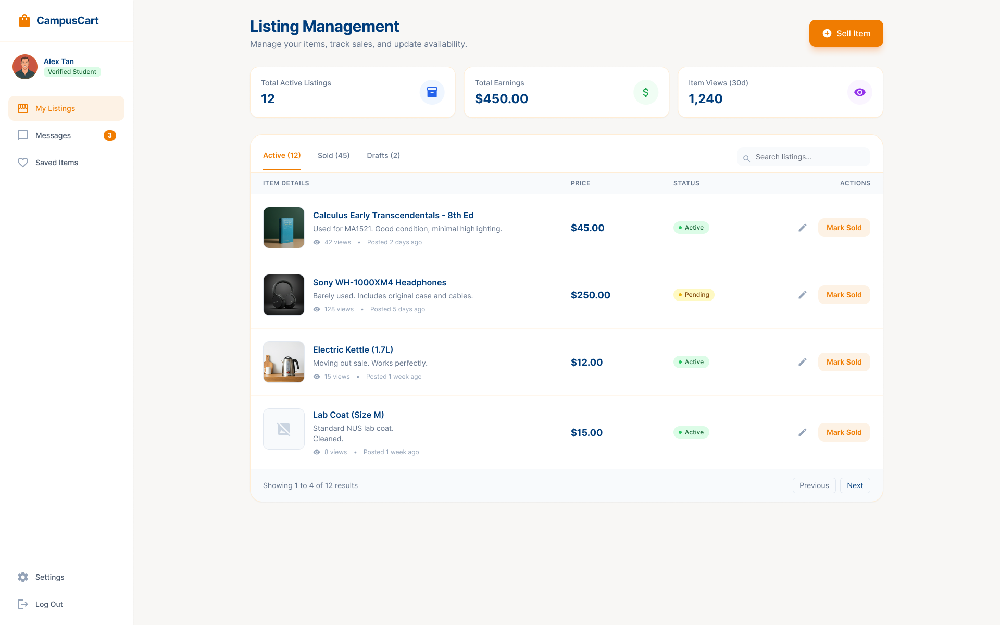
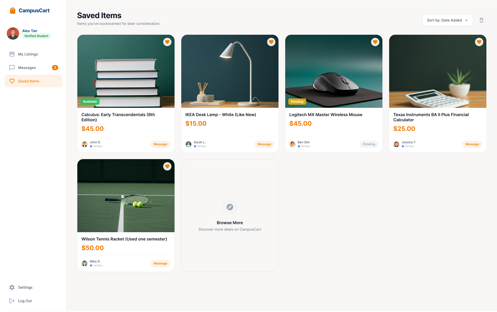
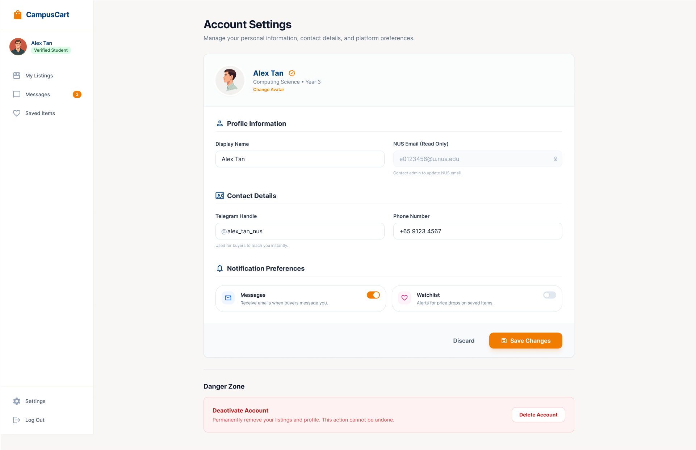
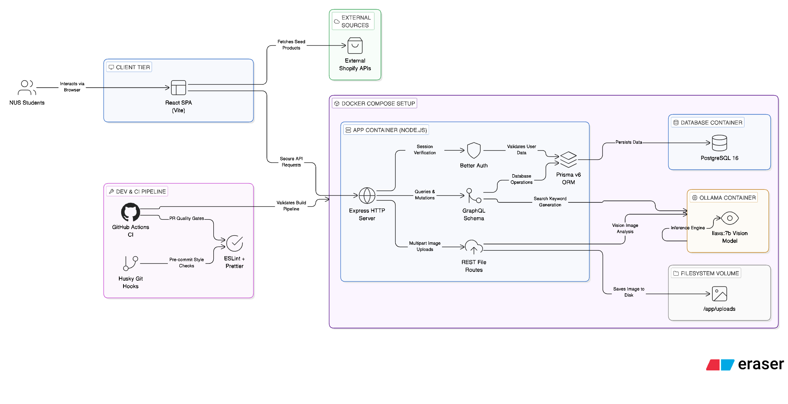

# IT5007 Final Project Report

**Course:** IT5007 Software Engineering on Application Architecture  
**Project:** CampusCart — NUS Campus Marketplace  
**Group:** 14  

Group number on Canvas: 14

Student ID (AxxxxxxxZ) | NUSNet ID (exxxxxxx) | Name (as it appears on Canvas)
-----------------------|----------------------|-------------------------------
A0183438X | e0310233 | Ang Lee Chuan
A0183378R | e0310173 | Chou Han Xian, Aaron
A0329448R | e1553775 | Liaw Jian Wei

---

## 1. Problem Statement & Motivation

The National University of Singapore has over 40,000 students, many of whom live on campus and cycle through textbooks, electronics, furniture, and other essentials every semester. Despite this constant demand, there is no dedicated, trusted channel for peer-to-peer student commerce. The existing alternatives present significant friction:

- **Lack of Trust:** On generic platforms like Carousell or Telegram, buyers have no way to verify whether a seller is a genuine NUS student. This creates safety and reliability concerns, particularly for high-value items or in-person meetups on campus.
- **Poor Discovery:** Telegram buy/sell groups are linear chat streams. Listings are buried within minutes, and there is no structured search, filtering, or categorization — making it nearly impossible for buyers to find specific items efficiently.
- **Inefficient Coordination:** The pervasive "PM me" culture across these channels wastes significant time on repetitive negotiations around pricing, item condition, availability, and meetup logistics.

**CampusCart** aims to resolve these issues by acting as a centralized, student-exclusive marketplace web application designed specifically for the NUS community. **CampusCart** also leverages local LLMs to streamline the listing creation process through AI-powered field population.

---

## 2. Design & Prototyping

Before writing any code, the team invested in a thorough design phase to define the platform's user experience and information architecture. Using **Figma**, we created high-fidelity wireframes for every core screen of the application. This design-first approach served several critical purposes:

1. **Alignment:** The prototypes acted as a shared visual contract among all three team members, ensuring everyone had an identical understanding of the target product before diverging into parallel development streams.
2. **Scope Definition:** By explicitly designing each page, we could objectively assess the MVP scope and identify which features were essential versus aspirational, preventing scope creep during implementation.
3. **Architecture Guidance:** The component structure visible in the prototypes directly informed our React component hierarchy and GraphQL schema design, reducing rework during development.

### 2.1 Authentication & Entry Point

The login screen establishes CampusCart's identity as an NUS-exclusive platform from the very first interaction. The prominent "Sign in with NUS Email" call-to-action and the "Exclusively for the NUS Community" badge immediately communicate trust and exclusivity.

<div class="figure">
  
</div>
<p class="figure-caption">Figure 1: Login page prototype — emphasizing NUS-exclusive access and verified student identity.</p>

### 2.2 Marketplace Browse & Discovery

The homepage serves as the primary discovery surface. The prototype establishes the core browsing experience: a hero search bar, category quick-filters (Textbooks, Furniture, Electronics, Clothing), and a card-based listing grid with condition badges, pricing, location tags, and seller verification status. A sidebar provides advanced filtering by condition, price range, and campus location.

<div class="figure">
  
</div>
<p class="figure-caption">Figure 2: Marketplace homepage prototype — hero search, category filters, and listing cards with condition/location metadata.</p>

### 2.3 Product Detail & Seller Interaction

The product detail view was designed to give buyers all the information they need to make a purchase decision without leaving the page. It features a multi-image gallery, structured item metadata (price, condition, category), a detailed text description, and a seller information card showing verification status and response time. The prominent "Make an Offer" and "Chat with Seller" buttons streamline the transaction initiation flow.

<div class="figure">
  
</div>
<p class="figure-caption">Figure 3: Product detail prototype — image gallery, item metadata, seller card, and direct offer/chat actions.</p>

### 2.4 Seller Dashboard & Listing Management

The seller dashboard provides a comprehensive management interface with at-a-glance analytics (active listings count, total earnings, item views), tabbed navigation for active/sold/draft listings, and inline actions (edit, mark sold) for each item. This design informed the GraphQL mutation structure for listing lifecycle management.

<div class="figure-grid">
  
  
</div>
<p class="figure-caption">Figure 4 (left): Listing creation form with photo upload, category, condition selector, and pricing. Figure 5 (right): Seller dashboard with listing management, analytics, and status tracking.</p>

### 2.5 Saved Items & Account Settings

The Saved Items view allows buyers to bookmark listings for later consideration, while the Account Settings page provides comprehensive profile management including personal information, contact details, notification preferences, and account lifecycle controls.

<div class="figure-grid">
  
  
</div>
<p class="figure-caption">Figure 6 (left): Saved items view with bookmarked listings and availability status. Figure 7 (right): Account settings with profile information, contact details, and notification preferences.</p>

> These seven prototypes collectively defined the visual language, component patterns, and user flows that guided CampusCart's implementation. While the final product evolved during development — adapting to technical constraints and new insights — the Figma designs remained the north star for the team's UI/UX decisions throughout the project.

---

## 3. Core Features & Implementation

### 3.1 Verified Authentication

To ensure trust and exclusivity, the platform utilizes a secure, session-based authentication system.

- **NUS Email Exclusivity:** Registration is strictly restricted to `@u.nus.edu` email domains. A server-side regex validator rejects all non-NUS email addresses at the point of account creation, ensuring the marketplace remains a closed, student-only community.
- **Robust Security:** The authentication layer is powered by an Express.js backend integrated with the **Better Auth** library. Passwords enforce strict security policies — minimum 8 characters, requiring uppercase letters, numbers, and special characters — with real-time validation feedback in the signup UI.
- **Protected Routing:** React Router wrappers enforce client-side session checks. Unauthenticated users are automatically redirected to the login page when attempting to access any protected route, while the backend independently validates session cookies on every GraphQL request.

### 3.2 Marketplace Architecture (Items for Sale)

- **Core Listing Lifecycle:** Sellers can create, view, edit, and delete listings. Each listing captures structured metadata including title, description, price, condition tag, category, and preferred meetup location.
- **Image Management:** Listings support photo uploads with a 5MB file-size limit. Images are persisted on the server filesystem and served via Express static middleware, decoupling binary storage from the GraphQL data layer.
- **Smart Filtering:** Buyers can browse active listings and filter by category and seller, enabling efficient discovery across the marketplace.

### 3.3 Requests Feature (Want to Buy)

In addition to selling, the platform supports a buyer-driven workflow where students can post items they are actively looking to purchase.

- **Request Lifecycle:** Students can create buying requests specifying a title, description, budget, and desired item condition.
- **Categorization & Location:** Requests are linked to the same category and location system as listings, providing a unified browse and search experience across both content types.
- **Unified Navigation:** Buying requests are easily accessible via the "+" quick-action menu and a dedicated "Want to Buy" dashboard view.

### 3.4 User Profile Enhancements

To build a personalized and trustworthy community, user profiles have been significantly expanded beyond basic authentication data.

- **Extended Profile Data:** Users can manage their bio, contact phone number, and preferred campus location.
- **Profile Customization:** Support for profile picture uploads allows users to personalize their presence on the platform.
- **Activity Tracking:** Profiles display a summary of the user's marketplace activity, including the number of active listings and open requests.

### 3.5 API Security & Authorization

All mutating API endpoints enforce server-side authentication and ownership verification.

- **Centralized Auth Helper:** A shared `requireAuth` utility is invoked across all GraphQL resolvers to ensure consistent session verification and standardized error handling.
- **GraphQL Auth Context:** Session cookies are verified on every GraphQL request via `auth.api.getSession()`, injecting the authenticated user object into the resolver context.
- **Status Validation:** Listings and requests implement strict status enums (`active`, `sold`, `fulfilled`, `removed`) with server-side validation to prevent illegal state transitions.
- **Cookie Security:** All frontend `fetch` calls use `credentials: 'include'` to securely transmit session cookies with every API request.

### 3.6 Data Seeding & External Product Integration

To simulate an active marketplace ecosystem and streamline developer onboarding, the platform features two complementary data-population strategies.

- **Prisma Seed Script:** A comprehensive seed script (`prisma/seed.js`) populates the database with demo users, categories, listings, and buying requests. Users are created through the Better Auth `signUpEmail` API, ensuring passwords are properly hashed and linked `Account` records are generated — allowing seeded users to log in immediately. The script is fully idempotent and can be re-run safely.
- **External Shopify Store Integration:** The marketplace augments its internal listings with real product data fetched from external Shopify storefronts (IUIGA, Bookshop.sg, NUS Press) via their public `/products.json` endpoints. Products are normalized into the platform's listing format with mock attributes (condition, location, verification status) assigned at runtime.

### 3.7 Client-Side Performance Caching

To avoid redundant network calls and improve page-load performance, fetched Shopify product data is cached in `sessionStorage` with a 5-minute TTL. Subsequent page visits within the cache window are served instantly from the local cache, eliminating unnecessary API calls to external storefronts.

### 3.8 Interactive NUS Campus Map (Spatial Discovery)

To enhance local discovery, the marketplace features a custom-built, interactive SVG map of the NUS Kent Ridge campus.

- **Interactive SVG Silhouette:** The map is a hand-traced SVG silhouette of the campus, overlaid on a high-fidelity reference image. Each campus landmark (UTown, Science Faculty, School of Computing, etc.) is mapped to precise relative (x, y) coordinates within the SVG viewBox.
- **Bi-directional Filtering:** Users can click pins on the map to instantly filter the listing grid. This interaction is bi-directional: selecting a location in the sidebar also highlights the corresponding pin on the map.
- **Dynamic HUD Overlay:** A glassmorphism-inspired HUD (Heads-Up Display) in the top-right corner of the map provides real-time feedback on the hovered or selected location, including a "Quick Clear" action for active filters.
- **Visual Cues:** Pins utilize a sophisticated selection system: active pins feature a thick white focus ring, a glowing white core, and a static translucent orange halo to stay distinct from background elements.

### 3.9 Request Demand Heatmap (Want to Buy Only)

To provide actionable data for sellers, the "Want to Buy" dashboard integrates a spatial demand heatmap.

- **Real-time Demand Aggregation:** A specialized `requestLocationCounts` GraphQL query uses Prisma's `groupBy` feature to count active buying requests across every campus landmark.
- **Heatmap Visualization:** Locations on the map are color-coded based on request density: **Blue (Low)** → **Orange (Mid)** → **Red (High)**.
- **Atmospheric Glow:** High-demand areas (top 30% intensity) feature a large, breathing radial glow animation that creates a "hotspot" effect around the pin, signaling urgent buyer activity to potential sellers.
- **Demand Dashboard Banner:** A dedicated "Demand Hotspots" banner above the listings grid highlights the busiest areas. Each hotspot is a clickable pill using NUS brand colors (Blue/Orange) that serves as a shortcut for spatial filtering.

### 3.10 AI-Powered Auto-Fill
To streamline the user experience, the platform integrates a local LLM to automate form population.
- **Visual Analysis:** Leveraging the `llava:7b` vision model via Ollama, users can upload a photo of an item to automatically generate a title, description, suggested price, condition, and category.
- **Model Selection & Rationale:** During development, we evaluated several vision LLMs. `moondream` (1.8B) was fast but struggled with complex prompts and JSON structure. `llama3.2-vision` (11B) was highly accurate but too slow for local CPU-only execution (~3-5 mins per image). We standardized on **`llava:7b`** as it provides the best balance of reasoning capability, prompt adherence, and local performance (~30-60s on average hardware).
- **Dual-Workflow Support:** This feature is available for both "Sell an Item" (listings) and "Request an Item" (buying requests) forms.
- **Human-in-the-Loop:** AI suggestions are presented for review, allowing users to modify any field before final submission, ensuring accuracy and control.
- **Branded Loading Experience:** Image analysis on local hardware typically takes 30–60 seconds. Rather than leaving users with an unresponsive form, the submission surface is replaced with a full-screen NUS-branded overlay powered by the `NusSpinner` component — a pulsing NUS blue arc, three bouncing dots with an alternating NUS orange highlight cycling across them, and rotating Linus-themed verbs ("Linus is on it...", "Roaring through the data...", etc.). Users can cancel the in-flight AI request at any time via an `AbortController`-backed cancel button, which immediately dismisses the overlay and restores the form to its previous state.

### 3.11 AI-Powered Search Recommendations
To prevent users from hitting dead ends during search, the platform uses the local LLM to proactively suggest alternative results.
- **Intelligent Fallback:** When a search query returns zero results, the system automatically triggers a request to the local `llava:7b` model to generate 3 broader or synonymous search terms.
- **Proactive Discovery:** Instead of displaying an empty state, the platform automatically filters the marketplace catalog using the AI-generated keywords and surfaces a "Recommended for You" gallery.
- **Fuzzy Word-Based Matching:** The recommendation engine uses a custom fuzzy matching algorithm that splits keywords into individual words and scans across titles, descriptions, categories, and storefront sources for high relevance.
- **Performance Optimization:** Requests to the local LLM are debounced by 1 second to prevent redundant API calls during active typing, ensuring a responsive UI even on hardware with limited resources.
- **Consistent Loading Feedback:** While recommendations are being generated, the search surface displays the same `NusSpinner` component used in the AI auto-fill flow — providing a unified, on-brand loading experience across all AI-driven interactions on the platform.

### 3.12 Payment Integration (Stripe)

To introduce a trusted transaction layer to the marketplace, CampusCart integrates the **Stripe** payment platform in test mode. This feature demonstrates industry-standard payment architecture — from PCI-compliant secret management to the full checkout UI — without processing any real charges.

**Design Decision: Stripe PaymentIntent Model**

Rather than collecting card details and charging them directly, CampusCart adopts Stripe's **PaymentIntent API pattern** — the current Stripe best practice for card payments. Under this model:

1. The server creates a `PaymentIntent` object via the Stripe SDK and returns only a short-lived `client_secret` to the browser.
2. The client uses Stripe.js to mount an embedded card form (`CardElement`) and, when ready, call `confirmCardPayment` with the `client_secret`.
3. At no point does the browser ever see the `STRIPE_SECRET_KEY` — it lives exclusively on the server, enforcing PCI DSS requirements.

This decoupling has a critical security implication: even if the frontend were fully compromised, an attacker cannot initiate or escalate charges without the server-side secret key.

**Implementation Scope**

The implementation covers the full checkout architecture without requiring real payment credentials:

| Layer | What was built |
|---|---|
| **Prisma schema** | `Order` model linking buyer, listing, and `paymentIntentId` for full transaction traceability |
| **GraphQL mutation** | `createPaymentIntent(listingId)` — validates listing availability, checks ownership, calls Stripe SDK, creates `Order` record |
| **Stripe service** | Lazy-initialized singleton (`getStripe()`) — server boots without crashing even when no key is configured, fails gracefully at call time |
| **Frontend service** | `stripePromise` loaded once from Stripe's CDN via `loadStripe()` — never re-instantiated, CSP-safe |
| **PaymentModal** | Full two-panel modal: order summary (image, title, price, seller) + Stripe Elements card form (styled to NUS brand tokens) |
| **ListingDetailPage** | "Buy Now" CTA with sold overlay, seller ownership guard, and modal integration |

**UX Flow**

```
User clicks "Buy Now"
  → Modal opens (loading state)
  → GraphQL mutation: createPaymentIntent
      → Server: validates listing → calls stripe.paymentIntents.create → saves Order (pending) → returns client_secret
  → Modal: Stripe Elements mounts card form with custom NUS blue appearance
  → User enters card details (test card: 4242 4242 4242 4242)
  → Submit → stripe.confirmCardPayment → success state
  → Listing shows "Sold" overlay
```

**What was intentionally deferred**

Two components are architectural decisions that are documented rather than implemented, as they require infrastructure outside the scope of an academic project:

- **Stripe Webhooks:** In production, Stripe calls a server endpoint (`POST /api/stripe/webhook`) to confirm payment success, signed with a webhook secret for tamper-proof delivery. This ensures Order status is updated reliably even if the client disconnects after payment. Implementing this requires a publicly accessible HTTPS URL and Stripe signature verification.
- **Live mode:** Switching from test keys (`sk_test_*`) to live keys (`sk_live_*`) activates real charge processing. The toggle is a single environment variable change — the application code is identical in both modes.

**Key Learning: Why not store card numbers?**

Stripe Elements are iframe-embedded inputs hosted on Stripe's domain. Card numbers never touch CampusCart's servers or JavaScript context — Stripe tokenizes them internally. This architectural boundary is why Stripe is able to absorb PCI DSS compliance on behalf of merchants: the payment handler never enters the merchant's data scope.

<div class="figure">
  
</div>
<p class="figure-caption">Figure X: Stripe payment modal — two-panel layout showing order summary and embedded Stripe Elements card form styled to NUS brand tokens.</p>

---

## 4. Developer Experience & Deployment Architecture

As a team of three developers working across different machines and operating systems, maintaining a frictionless, device-agnostic environment was as important as the application features themselves. We invested deliberately in the developer experience layer to eliminate setup friction, enforce code consistency, and ensure the platform could be evaluated without requiring any local development tooling.

### 4.1 Two-Flow Deployment Architecture

One of the most deliberate infrastructure decisions we made was the design of a **dual Docker Compose strategy** — separating the evaluator's experience from the developer's workflow into two distinct, purpose-built flows.

**Evaluator Flow — Single Command Startup (`docker-compose.yml`)**

For evaluators and the course instructor, the entire application stack — frontend, backend, PostgreSQL database, and the Ollama AI service — is orchestrated through a single command:

```bash
cp .env.example app/.env
docker compose up --build
```

The startup sequence is fully automated at the container level. The `app` service CMD executes three commands in sequence: `pnpm db:push` (schema synchronization), `pnpm db:seed` (demo data population), and `pnpm dev` (application startup). This guarantees that every evaluation begins from an identical, fully seeded state — 20 verified student accounts, 6 categories, 46 listings, and 20 want-to-buy requests — without requiring the evaluator to install Node.js, pnpm, or any other local tooling beyond Docker.

Service readiness is enforced through Docker Compose health checks. The `app` service declares `condition: service_healthy` dependencies on both the `db` and `ollama` services, preventing the application from starting before PostgreSQL accepts connections and the Ollama API is responsive. The Ollama service automatically pulls the `llava:7b` model (~4.7 GB) on first boot via an overridden container entrypoint, eliminating what was previously a manual post-startup step.

**Developer Flow — Split Infrastructure (`docker-compose.dev.yml`)**

For active development, running the application layer inside Docker introduces unnecessary overhead — rebuilds on every code change, slower feedback loops, and reduced debuggability. We therefore provide a separate, minimal `docker-compose.dev.yml` that runs only the stateful infrastructure services (PostgreSQL and Ollama), while the application itself runs natively on the developer's machine:

```bash
# Start infrastructure only
docker compose -f docker-compose.dev.yml up -d

# Run the application natively with hot-reload
cd app && pnpm install && pnpm dev
```

Vite's Hot Module Replacement and `nodemon`'s file watching provide instant feedback on frontend and backend changes respectively, with no container restarts required. A first-time database setup script (`pnpm db:setup`) consolidates schema push and seeding into a single command, after which the developer environment is fully operational.

This separation — stateful services in Docker, stateless application on the host — is the standard pattern for production-grade development workflows and eliminates the friction that typically causes environment inconsistencies across team members' machines.

### 4.2 Database Lifecycle Management

The database workflow is designed to be **safe by default and explicit when destructive**. Three distinct commands cover every scenario a developer or evaluator will encounter:

| Command | Behaviour | When to use |
|---|---|---|
| `pnpm db:push` | Applies schema changes to the database without touching data | After any change to `schema.prisma` |
| `pnpm db:seed` | Clears all data and reloads the full demo dataset | When a fresh, consistent dataset is needed |
| `pnpm db:setup` | Runs `db:push` then `db:seed` sequentially | First-time setup on a new machine |

`prisma generate` runs automatically as a `postinstall` hook on every `pnpm install`, ensuring the Prisma client is always in sync with the schema after a `git pull`. Developers never need to remember to regenerate the client manually.

The seed script (`prisma/seed.js`) creates all users through the Better Auth `signUpEmail` API rather than inserting raw database records. This ensures passwords are properly hashed, linked `Account` records are generated, and seeded users can log in immediately with valid sessions — faithfully replicating the production authentication flow in the demo environment.

### 4.3 Code Quality Assurance

- **Husky Git Hooks:** Client-side hooks enforced via Husky run on `pre-push`, validating branch naming conventions and preventing direct pushes to `main`. All team members work exclusively through Pull Requests, maintaining a clean and reviewable git history.
- **Linting & Formatting:** ESLint (flat config) and Prettier are configured project-wide. Running `pnpm lint:fix` and `pnpm format` before each commit ensures uniform code style across all contributors.
- **CI/CD Pipeline:** GitHub Actions automatically execute linting, formatting validation, and build checks on every Pull Request. This acts as an automated quality gate — no PR can be merged with failing checks, regardless of local environment differences.

### 4.4 Documentation & Onboarding

Recognising that the course instructor evaluates the project without access to the development team, we structured documentation around two distinct audiences, each with a dedicated entry point:

- **`resources/DEMO.md`** — A minimal evaluator guide. Prerequisites are reduced to Docker Desktop only. The guide covers the two setup commands, login credentials, and a curated list of features to evaluate. Troubleshooting steps address the most common failure modes (port conflicts, model download timing, DB readiness).
- **`README.md` (“For Developers” section)** — The canonical developer onboarding guide covering the three-step dev workflow (infrastructure, application, database), the core command reference, and the primary setup instructions needed to contribute locally.

---

## 5. Technical Architecture

### 5.1 System Architecture Overview

The diagram below illustrates the full system architecture of CampusCart — from the browser through to the data layer — and how each component is connected.

<div class="figure">
  
</div>
<p class="figure-caption">Figure 8: CampusCart System Architecture — illustrating the Docker Compose container routing, external API integrations, local AI services, and Developer Experience pipelines.</p>

### 5.2 Key Architectural Decisions

**Why GraphQL over REST?** The marketplace has multiple resource types (listings, requests, profiles) with overlapping relationships. GraphQL enables the frontend to fetch exactly the fields it needs in a single round-trip, avoiding over-fetching. The `@graphql-tools/schema` approach was chosen over Apollo Server to keep the setup lightweight — providing full GraphQL functionality without the additional abstraction layer that Apollo introduces.

**Why decouple file uploads from GraphQL?** GraphQL is not well-suited for binary data — multipart form uploads are non-standard in the spec and require special middleware. By routing image uploads through a dedicated REST endpoint backed by Multer, the GraphQL layer remains clean and type-safe while binary storage is handled separately.

**Why a shared Prisma singleton?** Node.js is single-threaded, and Prisma's connection pooling operates at the process level. Instantiating multiple `PrismaClient` instances — common in modular codebases — can exhaust the PostgreSQL connection pool. A shared singleton avoids this entirely.

**Why filesystem storage over a blob store?** For a locally-deployed academic submission with no external hosting requirement, the server filesystem is the simplest and most reliable storage option. The upload pipeline is architected so that the storage layer can be swapped (e.g., for S3 or Cloudflare R2) by modifying only the upload endpoint — the rest of the application is storage-agnostic.

### 5.3 Frontend Layer

- **Framework:** React powered by Vite for rapid compilation and Hot Module Replacement during development.
- **Styling:** Tailwind CSS v4, utilizing the modern `@theme` directive for zero-configuration, utility-first styling with customizable design tokens.
- **NUS Design System:** All UI is anchored to a custom design token set — `nus-blue (#003d7c)`, `nus-orange (#ef7c00)`, and their hover variants — declared once in `index.css` and consumed uniformly across the application. Reusable Tailwind component classes (`.btn-primary`, `.btn-outline`, `.card`, `.heading-caps`, `.badge-accent`, etc.) enforce visual consistency across all pages and components without duplicating utility strings.
- **NusSpinner:** A purpose-built, NUS-branded loading component used across all AI-driven interactions. It renders an animated NUS blue ring, three bouncing center dots with an orange accent cycling through them at a 600 ms interval, and rotating Linus-themed verbs that fade in with a CSS keyframe animation (`nus-verb-in`). The component accepts `size` (`sm`/`md`/`lg`), an optional static `verb`, and an `onCancel` callback — keeping it composable across different loading contexts without modification.

### 5.4 Backend Layer

- **API Server:** Node.js Express serving a GraphQL API via a lightweight setup (`graphql` + `@graphql-tools/schema`).
- **Modular GraphQL Architecture:** The backend follows a domain-driven structure. Each domain (`listings`, `requests`, `profile`) contains co-located schema definitions and resolvers, aggregated by a central merge layer.
- **Schema & Input Validation:** All inputs are strictly validated (e.g., phone number formatting, budget scales, status enums) to maintain data integrity at the API boundary.
- **Shared Authentication Utility:** A centralized `requireAuth` helper provides a single entry-point for security checks across all mutations, ensuring uniform enforcement.
- **Shared Prisma Singleton:** All resolver modules share a single `PrismaClient` instance, ensuring optimal database performance and preventing connection pool exhaustion.
- **Shared Constants:** Categories and campus locations are centralized into shared constant modules, ensuring total synchronization between frontend rendering and backend validation.
- **Database:** PostgreSQL 16, provisioned via Docker, with `pgvector` extension enabled for future semantic search capabilities.
- **ORM:** Prisma v6, providing type-safe database queries natively linked to the application layer.
- **File Upload Pipeline:** Multer handles multipart form data for image uploads via dedicated REST endpoints, cleanly decoupling binary storage from the GraphQL data layer.
- **Local LLM Infrastructure:** Ollama runs as a containerized service within the Docker network, serving the `llava:7b` vision model for image analysis without external API dependencies or costs.

---

## 6. Future Implementation Roadmap

As the marketplace scales beyond its MVP, the following architectural and functional expansions are planned to enhance user discovery and platform utility:

- **AI-Powered Search & Recommendations (Phase 2):** Expanding the current recommendation infrastructure to support deeper semantic vector-based search using `pgvector` for even more nuanced item discovery.
- **Omni-Channel & Mobile Integration:** Enhancing the frontend as a mobile-first experience to leverage native device mechanisms, such as immediate camera access for photo uploads.
- **Authentication Expansions:** Supplementing our current email validation framework with scalable OAuth 2.0 pipelines (e.g. Sign in with Google / GitHub).
- **Payment Production Upgrade:** The Stripe integration is ready for production with two changes: (1) swap `sk_test_*` / `pk_test_*` keys for live keys, and (2) implement `POST /api/stripe/webhook` with Stripe signature verification (`stripe.webhooks.constructEvent`) to reliably update `Order.status` from `pending` to `succeeded` or `failed` via Stripe's push delivery — resilient to browser disconnects and network failures at confirmation time.
