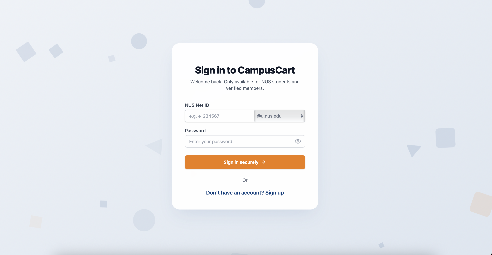
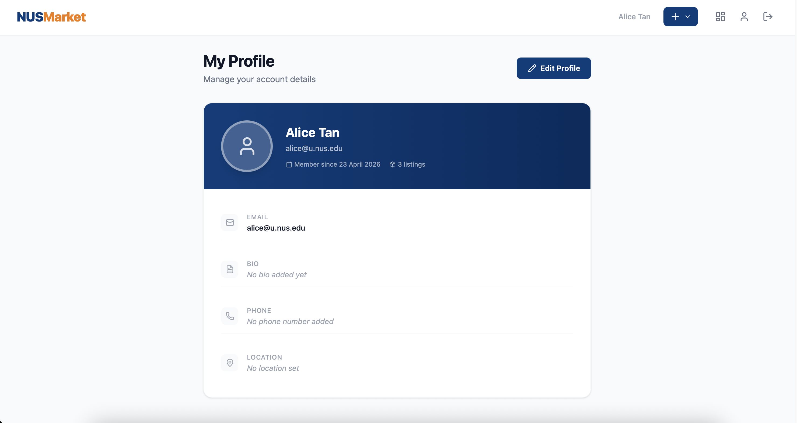
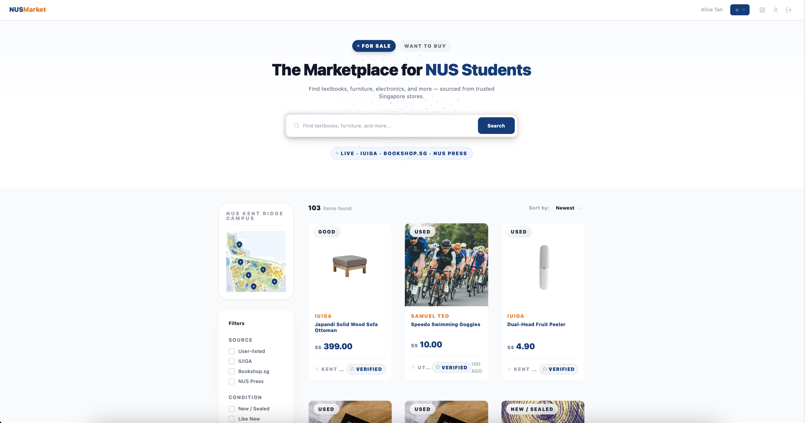
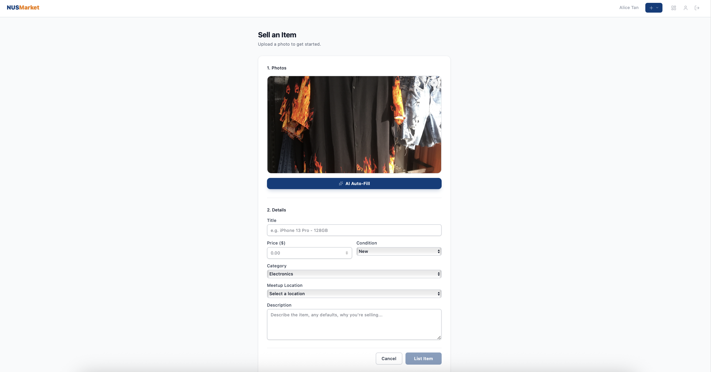
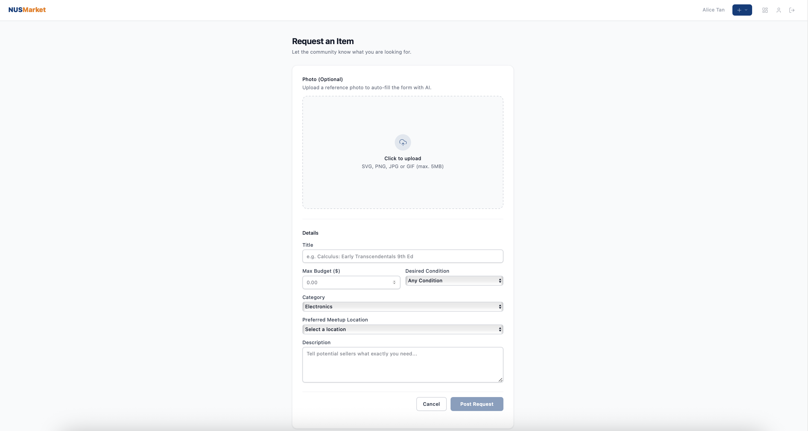
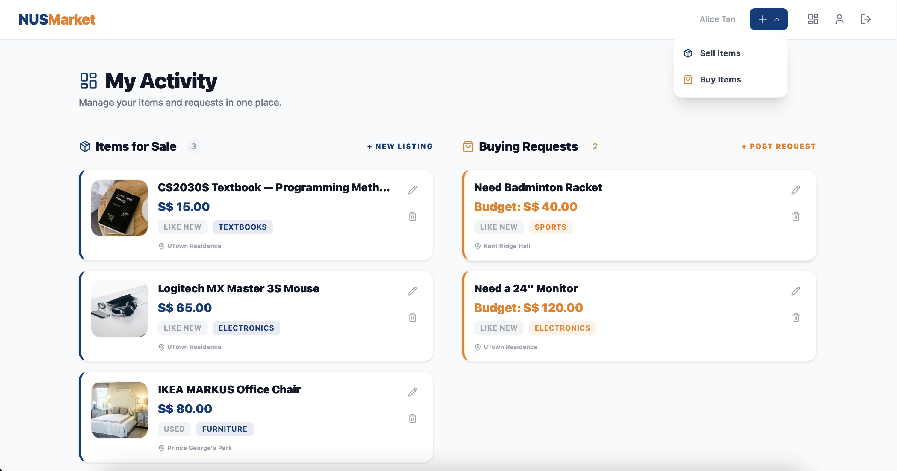
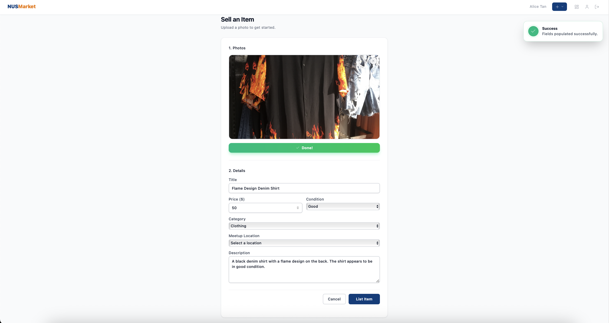
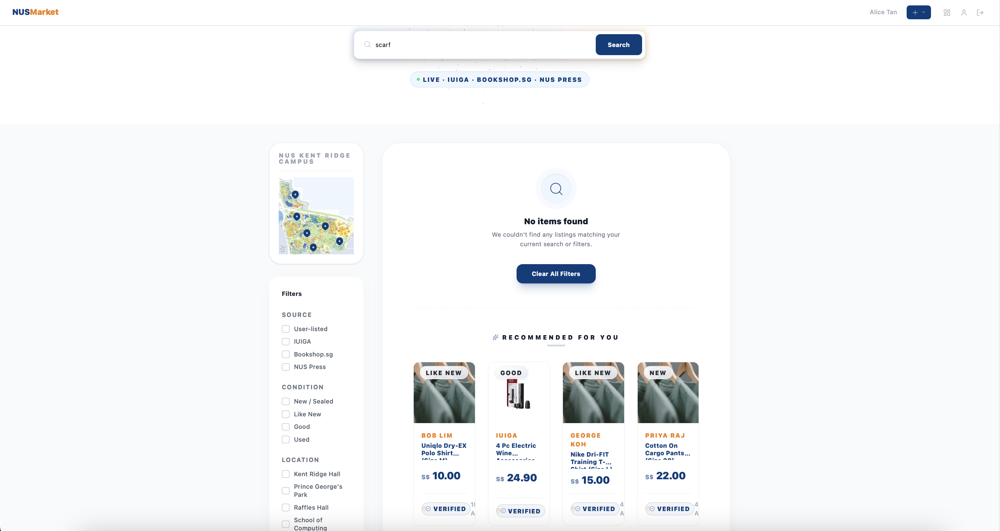
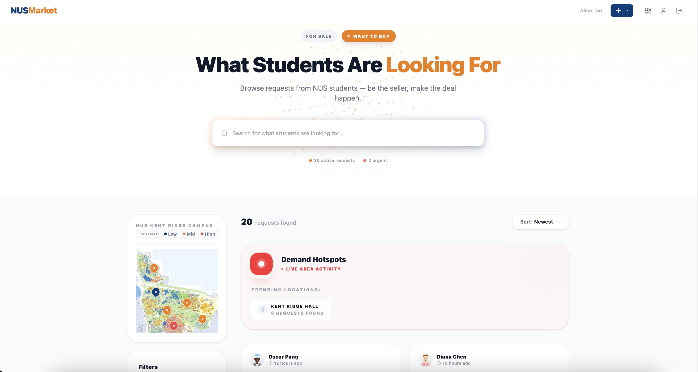
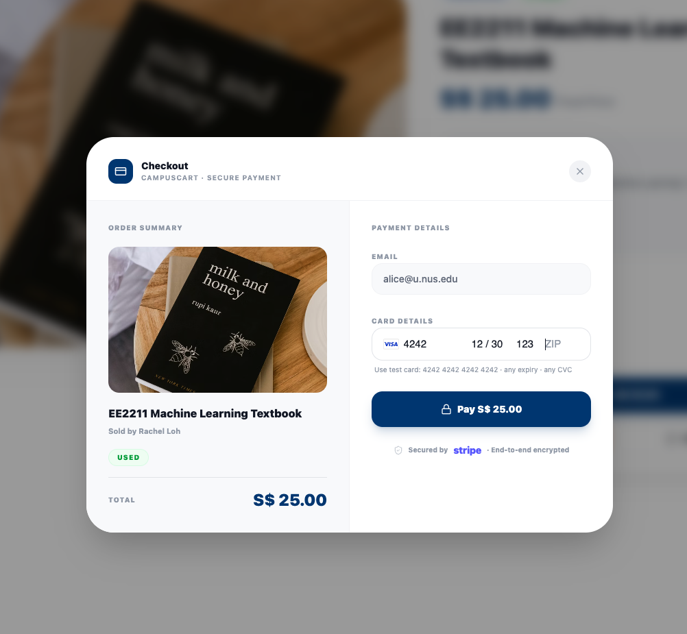

# IT5007 Final Project Report

**Course:** IT5007 Software Engineering on Application Architecture  
**Project:** CampusCart — NUS Campus Marketplace  
**Group:** 14  

Group number on Canvas: 14

Student ID (AxxxxxxxZ) | NUSNet ID (exxxxxxx) | Name (as it appears on Canvas)
-----------------------|----------------------|-------------------------------
A0183438X | e0310233 | Ang Lee Chuan
A0183378R | e0310173 | Chou Han Xian, Aaron
A0329448R | e1553775 | Liaw Jian Wei

---

## Table of Contents

- [1. Problem Statement, Motivation & Competition Analysis](#1-problem-statement-motivation--competition-analysis)
- [2. Solution Architecture & Design](#2-solution-architecture--design)
- [3. Core Features & Implementation](#3-core-features--implementation)
- [4. Software Engineering Practices](#4-software-engineering-practices)
- [5. Competition, Legal, and Business Model](#5-competition-legal-and-business-model)
- [6. Frameworks, Tooling & Developer Experience](#6-frameworks-tooling--developer-experience)
- [7. Future Scalability & Deployment](#7-future-scalability--deployment)
- [Appendix A — Prototype Mockups (Initial Figma designs)](#appendix-a--prototype-mockups-initial-figma-designs)

---

## 1. Problem Statement, Motivation & Competition Analysis

The National University of Singapore (NUS) has a large, dynamic student population with a constant need to buy and sell textbooks, electronics, furniture, and other essentials. However, there is no dedicated, trusted channel for peer-to-peer student commerce. Existing alternatives—Carousell and Telegram buy/sell groups—lack NUS verification, structured discovery, and efficient coordination, leading to trust and usability issues.

**CampusCart** was conceived to address these gaps by providing:
- **Verified NUS-only access** (via email authentication)
- **Structured, searchable listings** (categories, filters, map)
- **AI-powered listing creation and search**
- **Integrated payments (Stripe test mode)**
- **Modern, mobile-friendly UI**

**Relevance:** With 40,000+ NUS students cycling through goods each semester, the need for a safe, efficient campus marketplace will persist for years. The solution is designed to be robust and extensible for future cohorts or real-world deployment.

**Competition:**
- **Carousell:** No NUS verification, generic UI, no campus-specific features.
- **Telegram buy/sell groups:** Unstructured, no search/filter, trust issues.
- **CampusCart** differentiates via NUS-only access, AI features, and spatial discovery (interactive map, demand heatmap).

**Legal/Business Model:**
- All code is original or open source (see README for attributions). No proprietary dependencies. Project is open source and can be extended by future cohorts. No user data is collected beyond demo/test accounts. The architecture supports future commercialization or open-source community adoption.

---

## 2. Solution Architecture & Design

CampusCart is architected as a modern, modular full-stack web application, designed for reliability, extensibility, and a seamless developer and user experience. The architecture was informed by the initial Figma prototypes (see Appendix A), but evolved to address real-world technical constraints and opportunities for innovation.

  

Figure 2.1: System architecture diagram

### 2.1 System Overview
- **Frontend:** Built with React (Vite) for fast development and hot module replacement. Tailwind CSS and a custom NUS design system ensure visual consistency and accessibility. React Router enables SPA navigation. Components are modularized by domain (Marketplace, Profile, Payment, etc.) for maintainability.
- **Backend:** Node.js with Express serves a GraphQL API, using `@graphql-tools/schema` for lightweight, flexible schema stitching. The backend is organized by domain (listings, requests, profile), with resolvers and schema definitions co-located for clarity.
- **Database:** PostgreSQL (Dockerized) provides a robust, scalable data store. Prisma ORM enables type-safe queries and easy schema evolution. The database is seeded with demo data for consistent evaluation and onboarding.
- **AI Integration:** A local LLM (Ollama, `llava:7b`) powers image-based autofill and search suggestions. This approach avoids external API costs and privacy concerns, while enabling advanced features like vision-based form population and semantic search fallback.
- **Payments:** Stripe integration (test mode) demonstrates secure, industry-standard payment flows using the PaymentIntent API. Sensitive keys are never exposed to the frontend, and the architecture is ready for production upgrades (webhooks, live keys).
- **DevOps:** Docker Compose orchestrates both evaluator and developer flows. Health checks, automated seeding, and environment parity ensure a smooth experience for both instructors and contributors.

### 2.2 Key Architectural Decisions & Rationale
- **GraphQL over REST:** Chosen for its flexibility in fetching only the required data, reducing over-fetching and enabling rapid UI iteration. The lightweight schema approach avoids Apollo's complexity while retaining full GraphQL power.
- **REST for File Uploads:** GraphQL is not well-suited for binary data. By using REST endpoints (Multer) for image uploads, we keep the GraphQL layer clean and type-safe, and make it easy to swap storage backends in the future.
- **Prisma Singleton:** To avoid exhausting the PostgreSQL connection pool (a common Node.js pitfall), all resolvers share a single PrismaClient instance. This ensures efficient resource usage and reliability.
- **Session-Based Authentication:** Both frontend and backend independently validate sessions, ensuring security even if one layer is bypassed. ProtectedRoute components on the frontend and middleware on the backend enforce access control.
- **Component & Constant Sharing:** Categories and campus locations are defined in shared modules, ensuring total sync between frontend rendering and backend validation. This eliminates class-of-bugs where UI and API diverge.
- **Local LLM:** Running Ollama locally (in Docker) allows us to offer AI features without latency, cost, or privacy issues. We evaluated several models and standardized on `llava:7b` for its balance of speed and accuracy on commodity hardware.
- **Stripe PaymentIntent Model:** We adopted Stripe's recommended architecture for PCI compliance and security. The server creates PaymentIntents and only exposes client secrets to the frontend, never the secret key. This pattern is ready for production with minimal changes.

### 2.3 Design Evolution & Lessons Learned
- The initial Figma prototypes provided a strong foundation, but several features (e.g., AI autofill, map heatmap, Stripe integration) required architectural pivots and technical research.
- We prioritized developer experience: hot reload, one-command setup, and clear modularization enabled rapid iteration and onboarding.
- Security and data integrity were non-negotiable: all mutations are authenticated, and all user input is validated both client- and server-side.
- The architecture is intentionally extensible: adding new listing types, integrating new AI models, or swapping storage backends can be done with minimal refactoring.

**Appendix A** contains the original Figma prototypes that guided the UI/UX and component structure.

---

## 3. Core Features & Implementation

This section details the major features, their technical implementation, and the rationale behind key design choices. File references are provided for traceability and ease of evaluation.

### 3.1 Verified Authentication & User Management
- **NUS Email Exclusivity:** Registration is strictly restricted to `@u.nus.edu` email domains. Server-side regex validation (`server/auth.js`) ensures only NUS students can join. This builds trust and exclusivity.
- **Security:** Passwords must meet strict policies (min 8 chars, uppercase, number, special char). Sessions are managed via secure cookies. Both frontend and backend enforce authentication (see `src/components/ProtectedRoute.jsx`, `server/middleware/requireAuth.js`).
- **Profile Management:** Users can edit their bio, phone, location, and upload a profile picture (`src/pages/ProfilePage.jsx`, `server/graphql/profile/`). Activity tracking (listings, requests) is shown on the profile page.

  

Figure 3.1.1: Login page — NUS-exclusive authentication with email domain restriction.

  

Figure 3.1.2: Account settings — user can edit profile, contact details, and preferences.

### 3.2 Marketplace (Listings)
- **Discovery & Filtering:** Buyers can filter by category, location, and seller. The sidebar and map provide advanced filtering (`src/components/Marketplace/FilterSidebar.jsx`, `NUSMap.jsx`).
- **CRUD Operations:** Sellers can create, edit, delete, and browse listings. Each listing includes title, description, price, condition, category, and location (`src/pages/CreateListingPage.jsx`, `EditListingPage.jsx`, `MyListingsPage.jsx`, `server/graphql/listings/`).
- **Image Uploads:** Listings support photo uploads (max 5MB). Images are stored on the server and served via Express static middleware (`server/routes/upload.js`).

  

Figure 3.2.1: Marketplace homepage — listings from both external distributors and NUS users, with full filtering and search.

  

Figure 3.2.2: Create listing form — sellers enter title, description, price, condition, and upload images.

### 3.3 Requests (Want to Buy)
- **Buyer-Driven Workflow:** Students can post "want to buy" requests, specifying title, description, budget, and condition (`src/pages/CreateRequestPage.jsx`, `EditRequestPage.jsx`, `WantToBuyPage.jsx`, `server/graphql/requests/`).
- **Unified Navigation:** Requests and listings share the same category/location system and are accessible via dashboard and quick-action menus.

  

Figure 3.3.1: Create buy request form — students post items they want to purchase for others to fulfill.

  

Figure 3.3.2: My Listings dashboard — view, edit, or delete all your listings and requests.

### 3.4 AI-Powered Features
- **Auto-Fill:** Users can upload an item photo to auto-generate title, description, price, condition, and category using the local `llava:7b` model (`src/components/ui/AiAutoFillButton.jsx`, `server/services/ai.js`).
- **Search Suggestions:** When a search yields no results, the LLM suggests alternative queries (`src/components/ui/AiSearchSuggestions.jsx`).
- **Technical Rationale:** Local LLM avoids API costs, latency, and privacy issues. Model selection was based on speed and accuracy trade-offs.

  

Figure 3.4.1: AI-powered auto-fill — generate listing details automatically from an uploaded image.

  

Figure 3.4.2: AI search suggestions — recommended products shown when no direct matches are found.

### 3.5 Interactive Map & Demand Heatmap
- **SVG Map:** A custom SVG map of NUS campus enables spatial filtering of listings. Pins are clickable and bi-directionally synced with sidebar filters (`src/components/Marketplace/NUSMap.jsx`).
- **Demand Heatmap:** The "Want to Buy" dashboard visualizes request density with a color-coded heatmap and animated hotspots (`server/graphql/requests/requests.resolvers.js`).
- **Design Decision:** The map enhances local discovery and provides actionable data for sellers.

  

Figure 3.5.1: Demand heatmap — highlights campus locations with the most active buy requests.

### 3.6 Payments (Stripe)
- **Secure Checkout:** Stripe PaymentIntent API is used for secure, PCI-compliant payments. The server creates PaymentIntents and only exposes client secrets to the frontend (`server/services/stripe.js`, `src/components/payment/PaymentModal.jsx`).
- **Test Mode:** No real charges are processed. The architecture is ready for production with webhooks and live keys.
- **UX Flow:** Buyers see a two-panel modal with order summary and embedded Stripe Elements card form, styled to NUS brand tokens.

  

Figure 3.6.1: Stripe payment modal — secure checkout with order summary and embedded card form.

### 3.7 Performance, Caching & Dev Experience
- **Shopify Integration:** External product data is fetched and cached in `sessionStorage` (5-min TTL, `src/services/shopifyService.js`).
- **Developer Experience:** One-command setup for evaluators (`docker-compose.yml`), hot reload for developers (`docker-compose.dev.yml`). Linting, Prettier, Husky hooks, and CI/CD via GitHub Actions ensure code quality and consistency.
- **Documentation:** `README.md` (developer guide) and `resources/DEMO.md` (evaluator guide) provide onboarding and troubleshooting.

---

## 4. Software Engineering Practices

CampusCart was developed with a strong emphasis on software engineering best practices:
- **Documentation:** All major functions and modules are commented. Onboarding and troubleshooting are covered in the README and DEMO.md.
- **Usability:** All forms have validation, error messages, and are mobile-friendly. Navigation is intuitive, with clear CTAs and feedback.
- **Modularization:** React components, GraphQL resolvers, and services are modular and reusable. Shared constants for categories/locations ensure consistency.
- **Code Originality:** All code is original except where noted in README. Any borrowed code is attributed.
- **Automation:** Setup scripts for DB, seeding, and Docker. Lint/format on commit. CI/CD pipeline for PRs.
- **Testing & Quality:** Husky git hooks enforce branch naming and prevent direct pushes to main. All team members work via Pull Requests. GitHub Actions run linting, formatting, and build checks on every PR.

---

## 5. Competition, Legal, and Business Model

- **Competition:** See Section 1 for detailed analysis. CampusCart is unique in the NUS context, with features not found in Carousell or Telegram groups.
- **Legal:** All dependencies are open source. No proprietary code. No personal data stored beyond demo/test accounts. Project is open source and ready for future extension or commercialization.
- **Business Model:** While this is an academic project, the architecture supports future upgrades (real payments, mobile app, OAuth login, production deployment). The codebase is modular and well-documented for handover or open-source adoption.

---

## 6. Frameworks, Tooling & Developer Experience

CampusCart goes beyond standard academic expectations by implementing robust engineering workflows and tooling to ensure code quality, developer productivity, and maintainability:

- **Husky Git Hooks:** Enforces branch naming conventions, prevents direct pushes to `main`, and runs lint/format checks before commits.
- **DevTools Automation:** Includes scripts for auto git pull, GitHub PR templates, and streamlined onboarding for new contributors.
- **Prisma ORM:** Instead of using raw SQL or a basic database driver, CampusCart leverages Prisma ORM for type-safe, auto-completed database access in both JavaScript and TypeScript. Prisma enables rapid schema evolution with declarative migrations, generates a strongly-typed client for safer queries, and provides a visual Studio (Prisma Studio) for easy DB inspection. This approach reduces runtime errors, accelerates onboarding for new developers, and ensures that schema changes are consistently applied across all environments. Automated seeding and schema pushes keep local, dev, and CI environments in sync, which is much more robust than ad-hoc SQL scripts or manual migrations.
- **GitHub Workflows:** Automated CI/CD pipelines run linting, formatting, and build checks on every PR, ensuring codebase health and preventing regressions.
- **Prettier & ESLint:** Enforces consistent code style and catches errors early in the development process.
- **Docker Compose:** Provides one-command setup for both evaluators and developers, ensuring environment parity and easy onboarding.
- **Comprehensive Documentation:** All setup, troubleshooting, and onboarding steps are documented in `README.md` and `resources/DEMO.md`.

These frameworks and tools make the project more robust, maintainable, and ready for real-world collaboration or handover.

---

## 7. Future Scalability & Deployment

CampusCart is designed with extensibility and real-world deployment in mind. Several architectural choices make it easy to scale, migrate to cloud infrastructure, or add new features with minimal refactoring:

- **Cloud Image Storage:** While images are currently stored on the local server filesystem, the upload pipeline is abstracted so that switching to a cloud provider (e.g., AWS S3, Google Cloud Storage) only requires changing the upload endpoint and updating the image URLs. The rest of the application is storage-agnostic.
- **Containerization:** All services (frontend, backend, database, AI model) are containerized via Docker Compose, making it straightforward to deploy to any cloud provider supporting containers (AWS ECS, Azure, GCP, etc.).
- **Database Scalability:** PostgreSQL is production-ready and can be migrated to managed services (e.g., AWS RDS, Azure Database for PostgreSQL) with no code changes.
- **AI Model Flexibility:** The AI integration is modular. The Ollama service can be swapped for a cloud-based LLM or upgraded to a more powerful local model as hardware or budget allows.
- **Payments:** Stripe integration is ready for production. Switching from test to live mode is a single environment variable change. Adding webhook support for robust order status updates is straightforward.
- **Authentication:** The current email-based authentication can be extended to support OAuth (Google, NUSNET, etc.) for broader access and easier onboarding.
- **Mobile & PWA:** The frontend is built with responsive design and can be further enhanced as a Progressive Web App (PWA) or ported to React Native for a native mobile experience.
- **DevOps & CI/CD:** The project already uses GitHub Actions for CI. It can be extended to support automated deployment pipelines to cloud platforms.
- **Feature Roadmap:**
  - Semantic search and recommendations using vector databases (e.g., pgvector)
  - Real-time chat and notifications
  - Advanced analytics for sellers
  - Multi-campus or multi-tenant support

These design decisions ensure that CampusCart can grow from an academic prototype to a robust, production-ready platform with minimal technical debt.

---

## Appendix A — Prototype Mockups (Initial Figma designs)

The original Figma prototypes used during the design phase are reproduced below for reference. These mockups were used to align the team on layout, component behaviour, and information architecture prior to implementation.

### Authentication & Entry Point

The login screen establishes CampusCart's identity as an NUS-exclusive platform from the very first interaction. The prominent "Sign in with NUS Email" call-to-action and the "Exclusively for the NUS Community" badge immediately communicate trust and exclusivity.

  

Figure A.1: Login page prototype — emphasizing NUS-exclusive access and verified student identity.

### Marketplace Browse & Discovery

The homepage serves as the primary discovery surface. The prototype establishes the core browsing experience: a hero search bar, category quick-filters (Textbooks, Furniture, Electronics, Clothing), and a card-based listing grid with condition badges, pricing, location tags, and seller verification status. A sidebar provides advanced filtering by condition, price range, and campus location.

  

Figure A.2: Marketplace homepage prototype — hero search, category filters, and listing cards with condition/location metadata.

### Product Detail & Seller Interaction

The product detail view was designed to give buyers all the information they need to make a purchase decision without leaving the page. It features a multi-image gallery, structured item metadata (price, condition, category), a detailed text description, and a seller information card showing verification status and response time. The prominent "Make an Offer" and "Chat with Seller" buttons streamline the transaction initiation flow.

  

Figure A.3: Product detail prototype — image gallery, item metadata, seller card, and direct offer/chat actions.

### Seller Dashboard & Listing Management

The seller dashboard provides a comprehensive management interface with at-a-glance analytics (active listings count, total earnings, item views), tabbed navigation for active/sold/draft listings, and inline actions (edit, mark sold) for each item. This design informed the GraphQL mutation structure for listing lifecycle management.

  
  

Figure A.4 (left): Listing creation form with photo upload, category, condition selector, and pricing. Figure A.5 (right): Seller dashboard with listing management, analytics, and status tracking.

### Saved Items & Account Settings

The Saved Items view allows buyers to bookmark listings for later consideration, while the Account Settings page provides comprehensive profile management including personal information, contact details, notification preferences, and account lifecycle controls.

  
  

Figure A.6 (left): Saved items view with bookmarked listings and availability status. Figure A.7 (right): Account settings with profile information, contact details, and notification preferences.

> Note: These prototypes informed the implemented UI. For the formal report we moved the full prototype documentation to this appendix so the main body can focus on the delivered features.
