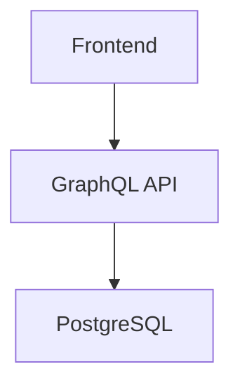

# IT5007 Group 8 Report Generator

This directory contains the markdown source file for our final project report and the tooling needed to automatically compile it into a beautifully formatted, academic PDF.

We generate the PDF using a headless Chrome instance via `md-to-pdf` so that it supports standard GitHub Flavored Markdown, A4 sizing, margins, and automated `Page X of Y` footers.

## How to Compile the PDF via Terminal

If you want to generate the official PDF for submission or review, run the following commands from the terminal:

```bash
# 1. Navigate into the report folder
cd grp8-report

# 2. Install dependencies (only required the first time!)
pnpm install

# 3. Generate the PDF manually
pnpm run build:pdf
```

Your compiled report will instantly be exported as `IT5007_Grp8_Report.pdf` within this folder.

### Auto-Compile (Watch Mode)

If you are actively typing the report and want the PDF to be automatically re-generated every time you save the `IT5007_Grp8_Report.md` file, run:

```bash
npm run watch:pdf
```

---

## 💡 Pro-Tip: Viewing in VS Code

For the fastest developer experience, you don't even need to compile the PDF manually while drafting. You can view the Markdown exactly as it will appear in the PDF right inside VS Code.

### Recommended VS Code Extensions:

1. **Markdown PDF** (`yzane.markdown-pdf`)
   - **How to use:** Install it, open `IT5007_Grp8_Report.md`, right-click anywhere in the editor, and select `Markdown PDF: Export (pdf)`.

2. **Markdown Preview Enhanced** (`shd101.markdown-preview-enhanced`)
   - **How to use:** Install it, open the `.md` file, and press `Cmd+K` then `V` to open the split live-preview pane.

If you don't want to install extensions, just rely on VS Code's native preview (`Cmd+Shift+V`) to quickly verify your markdown structure, taking comfort in knowing the `npm run build:pdf` command will make it look gorgeous for the final PDF submission!

---

## 🖼️ Adding Images & Screenshots to the Report

Place any images (screenshots, diagrams, photos) inside the `images/` folder, then reference them in the markdown using a relative path:

```markdown

```

**Best practices:**

- Use descriptive filenames: `listing-page.png`, `auth-flow.png`
- Preferred formats: `.png` for screenshots, `.svg` for diagrams, `.jpg` for photos
- Keep file sizes reasonable — under 1MB per image is fine for PDF output

The PDF compiler uses headless Chrome, so all standard image formats render correctly. No extra config needed — just drop the file in `images/` and reference it.

---

## 📊 Architecture Diagrams (Mermaid)

The report supports **Mermaid diagrams** natively — no images needed. Write diagrams directly in the markdown using fenced code blocks:

````markdown

````

Mermaid diagrams render automatically when building the PDF. This is the recommended way to include architecture, flow, and sequence diagrams since they version-control cleanly as text.
